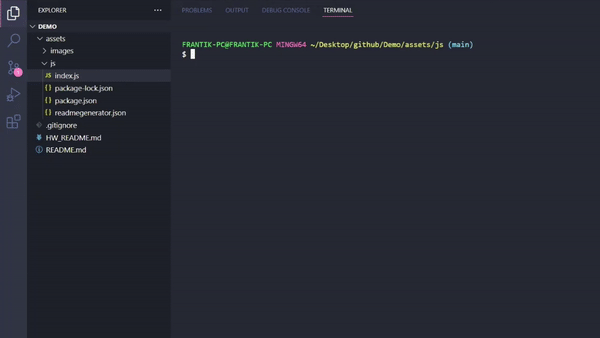
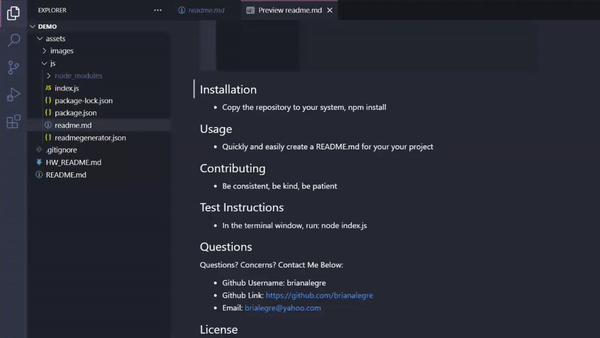

# 09-NodeJS-Homework

Create a command-line application that dynamically generates a professional README.md file from a user's input using the [Inquirer package](https://www.npmjs.com/package/inquirer)

# Application Preview

    

    

    

    

# Links

-   Github Repository:
    -   https://github.com/brianalegre/09-NodeJS-Homework
-   Video Demo (Youtube):
    -   https://www.youtube.com/watch?v=-u86SUE1YF8
-   Video Demo (Github):
    -   https://github.com/brianalegre/09-NodeJS-Homework/blob/main/assets/images/READMEGenDemo.mp4
-   Generated README:
    -   https://github.com/brianalegre/09-NodeJS-Homework/blob/main/assets/js/readme.md

# Criteria

-   Inquirer
-   CLI accepts user input
-   User Inputs gets created with:
    -   Title of Project
        -   Text Input
    -   Table of Contents
        -   Clickable links to each section
    -   Installation
        -   Text Input
    -   Usage
        -   Text Input
    -   License
        -   List of Options
        -   A badge for that license is added near the to of the README
    -   Contributing
        -   Text Input
    -   Tests
        -   Text Input
    -   Questions
        -   Text Input
        -   Enter Github Username
        -   Enter Email
